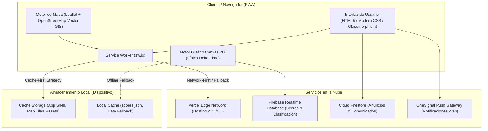

# UBICATEC 2.0 — Guía Inteligente del Campus del ITP

<p align="center">
  
</p>

<p align="center">
  <strong>Plataforma Web Progresiva (PWA) de Orientación Espacial, Navegación Offline y Servicios del Instituto Tecnológico de Puebla.</strong>
</p>

<p align="center">
  <a href="https://ubicatec.puebla.tecnm.mx"></a>
  <a href="https://github.com/Richpol99/ubicatec-android-showcase"></a>
  <a href="https://github.com/Richpol99/ubicatec-admin-showcase"></a>
  
  
</p>

---

> ### 🛡️ Nota de Propiedad Intelectual y Confidencialidad
> **UBICATEC 2.0** es una obra de software registrada y protegida legalmente ante el **Instituto Nacional del Derecho de Autor (INDAUTOR)** en México.  
> Por motivos de estricta protección a la propiedad intelectual, derechos de autor y convenios institucionales, **el código fuente completo de la aplicación se encuentra en un repositorio privado**.
>
> Este repositorio público constituye un **Estudio de Caso de Ingeniería de Software (*Technical Case Study*)** y portafolio profesional, diseñado para documentar la arquitectura de sistemas, decisiones de diseño técnico, resolución de problemas y stack tecnológico implementado.

---

## 📌 1. Visión del Proyecto y Problemática

El campus del **Instituto Tecnológico de Puebla (ITP)** cuenta con decenas de edificios, laboratorios especializados, canchas deportivas, áreas administrativas y múltiples puntos de acceso peatonal y vehicular distribuidos a lo largo de varias hectáreas.

### La Problemática:
- **Desorientación de la comunidad estudiantil:** Cada semestre, miles de estudiantes de nuevo ingreso y visitantes sufren demoras considerables para localizar aulas y laboratorios en sus primeras semanas de clases.
- **Pérdida de conectividad:** Existen zonas dentro del campus con cobertura móvil limitada o nula, lo que inutilizaba las herramientas de mapas convencionales (como Google Maps genérico, que carece del mapeo interior detallado de las facultades del ITP).
- **Falta de información centralizada:** No existía una fuente interactiva que combinara mapa, ubicación de servicios médicos, sanitarios, rutas seguras de evacuación y canales de avisos en tiempo real.

### La Solución:
**UBICATEC 2.0** fue concebido y desarrollado desde cero como un ecosistema PWA interactivo, accesible y de alta disponibilidad, que funciona de forma **100% autónoma sin conexión a internet** una vez instalado, guiando al usuario con precisión métrica mediante geolocalización asistida.

---

## ✨ 2. Características Principales

- 🗺️ **Mapeo Cartográfico del Campus:** Renderizado vectorial optimizado de cada aula, laboratorio, edificio administrativo, sanitario, cafetería y punto de encuentro.
- 📶 **Arquitectura Offline-First:** Toda la aplicación, sus mapas, capas de datos espaciales y recursos estáticos se almacenan en caché local a través de Service Workers dedicados.
- 🎯 **Geolocalización en Tiempo Real con HUD:** Detección de posición del usuario dentro del campus con cálculo dinámico de distancia métrica hacia el edificio o aula destino.
- 🔍 **Buscador Inteligente y Filtros por Categoría:** Búsqueda predictiva instantánea y filtrado granular por tipos de edificio (Aulas, Laboratorios, Administrativo, Deportivo, Accesos, Puntos de Reunión).
- 🔄 **Vistas Panorámicas 360°:** Integración multimedia para el reconocimiento visual inmersivo de las fachadas y accesos a edificios clave.
- 🔔 **Sistema de Avisos y Notificaciones Push:** Integración de Web Push Notifications vía OneSignal para alertas institucionales, noticias y eventos de jornadas académicas.
- 🕹️ **Módulo de Gamificación Integrado:** Centro de esparcimiento estudiantil que incluye recreaciones optimizadas en Canvas 2D de videojuegos clásicos (Flappy Bird y Pacman) con tabla de récords globales en la nube.

---

## 🏛️ 3. Arquitectura del Sistema

El sistema implementa una arquitectura modular desacoplada basada en estándares web abiertos, priorizando la máxima velocidad de carga (*Core Web Vitals* óptimos) y resiliencia ante cortes de red:



### Estrategia de Caché del Service Worker (`sw.js`):
1. **Precaching del App Shell:** Durante el ciclo de instalación del Service Worker, se descargan y versionan todos los recursos nucleares (`index.html`, `aula.html`, estilos CSS minificados, scripts de utilidad y fuentes web).
2. **Stale-While-Revalidate para datos dinámicos:** Permite mostrar información instantánea desde el caché del dispositivo mientras se comprueba en segundo plano si existen actualizaciones de edificios o avisos.
3. **Manejo resiliente de fallos:** Si una consulta a Firebase o a una API externa falla por falta de señal, el sistema conmuta sin fisuras hacia respaldos locales empaquetados (`data/*.json`), garantizando que la experiencia de usuario nunca se interrumpa.

---

## 🛠️ 4. Stack Tecnológico

| Capa / Dominio | Tecnología / Herramienta | Justificación Técnica |
| :--- | :--- | :--- |
| **Frontend Core** | HTML5 Semántico, CSS3 Moderno, JavaScript (ES6+ Vanilla) | Máximo rendimiento, cero dependencias pesadas de frameworks, menor huella de memoria en dispositivos móviles de gama baja y media. |
| **Diseño y UI/UX** | CSS Custom Properties, Glassmorphism, Bootstrap Grid | Interfaz moderna, adaptativa (mobile-first), temas de alto contraste y compatibilidad cross-browser. |
| **Motor de Mapas & GIS** | Leaflet.js, OpenStreetMap (OSM) data, GeoJSON | Manejo eficiente de geometrías espaciales vectoriales, marcadores personalizados interactivos y polígonos del campus. |
| **Offline & PWA** | Service Workers API, Web App Manifest, Cache Storage API | Instalabilidad nativa en Android/iOS/Desktop, funcionamiento autónomo sin conexión a internet y arranque instantáneo. |
| **Backend & Cloud** | Google Firebase (Realtime Database, Cloud Firestore) | Sincronización en tiempo real de puntuaciones globales, anuncios administrativos dinámicos y baja latencia. |
| **Push Notifications** | OneSignal Web Push SDK | Comunicación asíncrona directa con los alumnos para avisos institucionales y jornadas académicas. |
| **Infraestructura** | Vercel Edge Platform | Despliegue global en el borde (*Edge*), compresión Brotli/Gzip automática y tiempos de respuesta ultra-bajos. |

---

## 🧠 5. Retos de Ingeniería y Soluciones Implementadas

### Reto 1: Navegación y Cartografía 100% Offline
- **Problema:** Los mapas interactivos tradicionales dependen de la descarga constante de baldosas (*tiles*) desde servidores remotos. En un campus universitario con zonas muertas, esto provocaba pantallas grises y errores de renderizado.
- **Solución:** Se diseñó una estrategia de serialización y empaquetado de datos geoespaciales propios en formato vectorial (`.osm` / JSON estructurado), servidos localmente e indexados por el Service Worker, eliminando por completo la dependencia de peticiones HTTP en tiempo real para visualizar las instalaciones.

### Reto 2: Rendimiento Gráfico y Renderizado Sub-Píxel en Mini-Juegos
- **Problema:** En el módulo de gamificación (Flappy Bird arcade), las implementaciones con `setInterval` o cálculos delta rígidos producían caídas intermitentes de fotogramas (micro-stuttering) en monitores con tasas de refresco distintas a 60Hz (120Hz/144Hz de laptops modernas).
- **Solución:** Se reconstruyó el bucle del juego implementando un **Delta-Time Loop continuo** desacoplado de la tasa de refresco, normalizado a 60 FPS base con suavizado sub-píxel de hardware. Esto garantizó una tasa de cuadros estable y cero latencia de entrada (*input lag*).

### Reto 3: Compatibilidad Multiplataforma y Soporte para iOS PWA
- **Problema:** Safari en iOS impone limitaciones estrictas a las PWAs (restricciones en Push API, manejo de pantalla completa y políticas de instalación manual).
- **Solución:** Se implementó detección reactiva del agente de usuario con modales interactivos y guías paso a paso de *"Añadir a pantalla de inicio"* (*Add to Home Screen - A2HS*) específicas para WebKit/iOS, junto con fallbacks elegantes para permisos de notificación.

---

## 👥 6. Equipo de Desarrollo

Este proyecto fue desarrollado por estudiantes comprometidos del **Instituto Tecnológico de Puebla (ITP)**:

- 👨‍💻 **Ricardo Armando Polanco Villa** — *Líder de Proyecto & Full Stack Developer*  
  [](https://github.com/Richpol99)
  [](https://www.linkedin.com/in/polanco-villa-ricardo-armando-b1651a2bb/)
- 🤝 **Luis David Solis Martinez** — *Líder de Apoyo*
- 🎨 **Liliana Miranda Jimenez** — *Frontend Developer*
- ⚙️ **Miguel Angel Vargas Garcia** — *Backend Developer*
- 📐 **José Eduardo Cabrera Corzo** — *Desarrollo y Soporte*

---

## 📄 7. Marco Legal y Registro de Obra

```
REGISTRO PÚBLICO DEL DERECHO DE AUTOR
Instituto Nacional del Derecho de Autor (INDAUTOR) — México
Obra: UBICATEC / UBICATEC 2.0
Titular / Derechos de Autor: © Ricardo Armando Polanco Villa y Coautores.
Todos los derechos reservados.
```

Queda estrictamente prohibida la reproducción, distribución, ingeniería inversa o explotación total o parcial del código fuente, arquitectura interna y activos visuales de esta obra sin la autorización expresa y por escrito de los titulares de los derechos de autor.

---

<p align="center">
  Diseñado con dedicación para la comunidad estudiantil del <strong>Instituto Tecnológico de Puebla</strong>.
</p>
